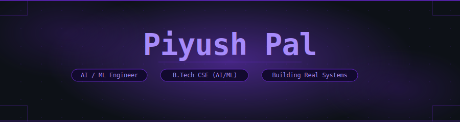

<p align="center">
  
</p>

<p align="center"></p>

<div align="center">

*I'm 20. I build adversarial ML systems and iOS apps —*
*not demos, not tutorials. BLING runs 8 microservices, streams through Kafka,*
*and has logged 100% evasion on every fraud topology it's ever generated.*
*MoodNest ships on iOS. Both are real.*

</div>

<p align="center"></p>

## Stack

<p align="center">
  
</p>

<p align="center">
  <sub>NetworkX · SHAP · Isolation Forest · CoreML · SwiftUI · WebSockets · Kafka · Vite</sub>
</p>

<p align="center"></p>

## Systems

<p align="center"></p>

**[BLING — Adversarial Financial Graph Topology Engine](https://github.com/Piyush-072006-B/bling-redteam)**
*Python · FastAPI · Apache Kafka · NetworkX · Docker · Redis · PostgreSQL · React · Vite · WebSocket*

8 microservices. A fully automated adversarial loop that generates synthetic money-laundering
graph topologies, mutates them, streams them through Kafka, and evaluates evasion against
detection heuristics — without human input. The Robustness Orchestrator runs the full
generate → fingerprint → stream → evaluate → mutate → export cycle continuously.

**65+ immutable run records. 57 canonical evasion exports. 0.0% detection rate on all
gen-0 topologies across all 7 fraud pattern families.**

Safeguarded: no automatic model updates. Human investigators validate every exported
pattern before it touches production logic.

<p align="center"></p>

**[MoodNest — iOS Mental Wellness Tracker](https://github.com/Piyush-072006-B/MoodNest-7.2F2)**
*Swift · SwiftUI · iOS · Xcode*

Native iOS mental wellness app built fully in SwiftUI. Users log daily
mood entries, track emotional patterns over time, and visualize their
mental state through a clean, minimal interface. No third-party
dependencies — pure Swift, pure SwiftUI, built the right way.
Ships on iOS and was built to solve a real problem:
most mood apps are either too clinical or too cluttered.
MoodNest is neither.

<p align="center"></p>

*Also: [ToDoApp](https://github.com/Piyush-072006-B/ToDoApp) · [Nectar](https://github.com/Piyush-072006-B/Nectar) · [PatsApp](https://github.com/Piyush-072006-B/PatsApp) · [Grocery-List](https://github.com/Piyush-072006-B/Grocery-List)*

<p align="center"></p>

## Currently

```
→  BLING Phase 2 — replacing static heuristics with a trained GNN detector
→  Grinding DSA — arrays, trees, graphs, dynamic programming (Java)
→  Learning Java from scratch — building the fundamentals properly
→  Exploring hackathons — looking for the next problem worth solving
→  New projects in the pipeline — stealth mode, ideas taking shape
→  Reading: transformer architectures · adversarial ML · graph theory
```

<p align="center"></p>

## Signals

<p align="center">
  
</p>
<p align="center">
  
  
  
</p>
<p align="center">
  
</p>

<p align="center">
  
</p>

<p align="center"></p>

The through-line in what I build is making hidden structure visible — fraud patterns hiding inside clean transaction graphs, emotional patterns hiding in daily behavior. I build the infrastructure that makes intelligence legible, not just functional. Adversarial and mobile. Knowing how systems break makes me better at building ones that don't.

<p align="center"></p>

<p align="center">
  <a href="mailto:piyush34305@gmail.com">
    
  </a>
  &nbsp;
  <a href="https://www.linkedin.com/in/piyush-pal-pp034305">
    
  </a>
  &nbsp;
  <a href="https://github.com/Piyush-072006-B">
    
  </a>
</p>

<p align="center">
  
</p>
